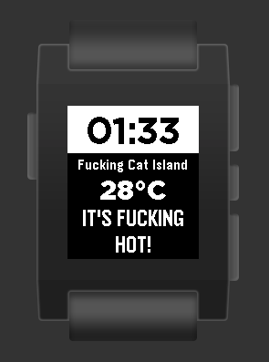

# Pebble Watchface - Authentic Weather

Pebble Watchface written in C and Javascript, displaying the time, temperature and a honest description of the weather at the current location.

## Install

Download [the pbw](https://github.com/adrianchifor/authentic-weather-pebble/releases/download/1.0/AWeather.pbw) and install on the watch by clicking on the .pbw in the Android file system and opening it with the Pebble app.
